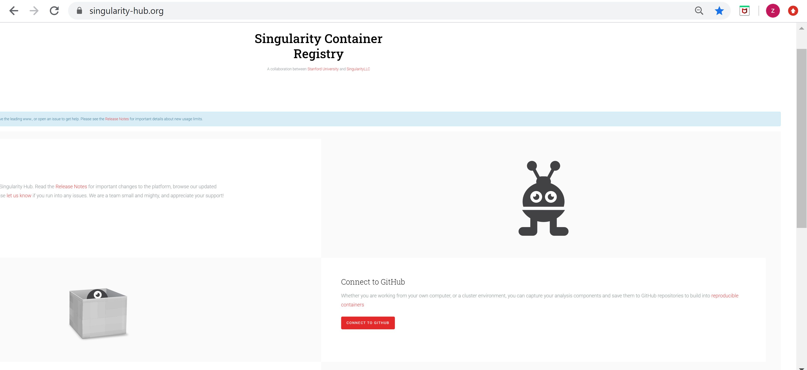
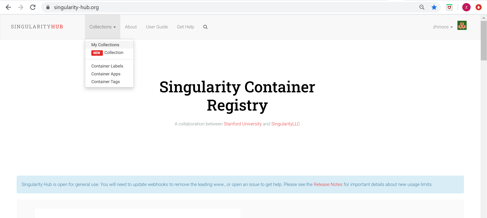
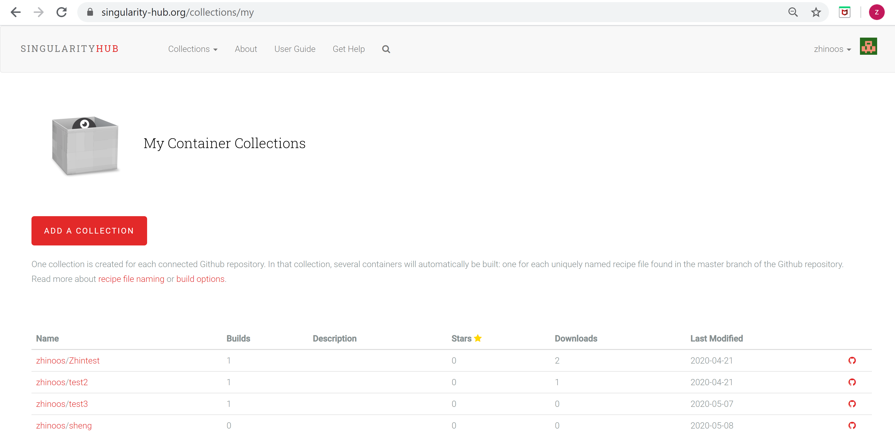
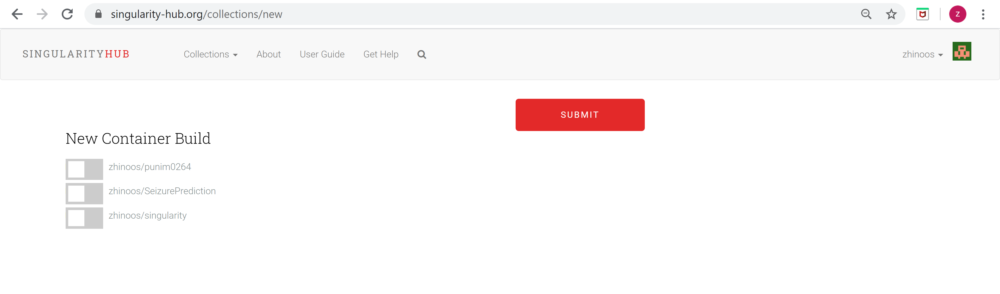
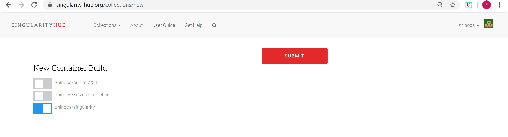
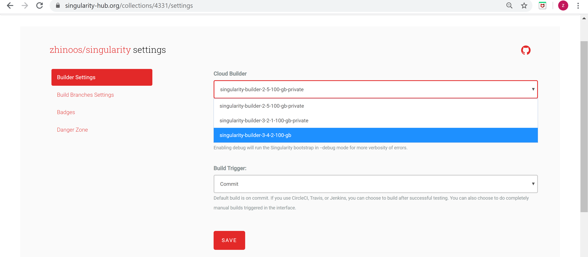
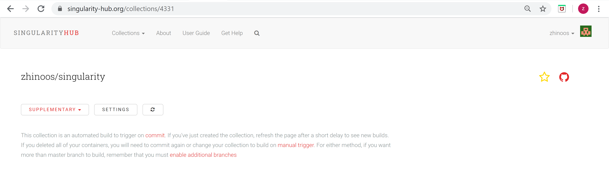
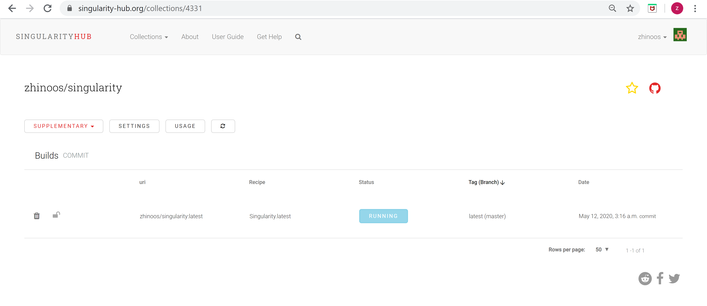
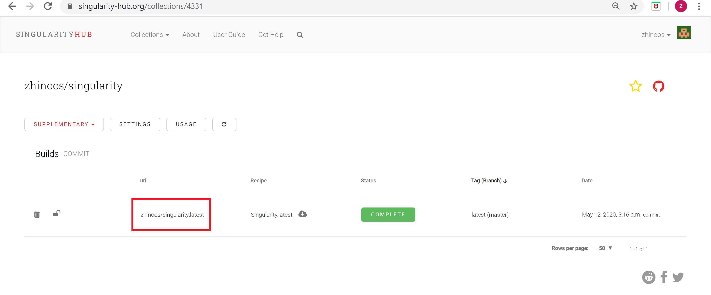

# SingularityTutorial

# How to create a Singularity recipe?

"This tutorial has been mainly reproduced from the Singularity resources referenced at the end of this document. This document is only gathered for accelerating and facilitating the process of building images and containers to run your developed codes on Melbourne university’s HPC server towards our research goals for improving the performance of seizure prediction algorithms hosted in Epilepsyecosystem.org. All the text is copied and pasted from their original resources."


## 1.	What is Singularity?
Singularity enables users to have full control of their environment. Singularity containers can be used to package entire scientific workflows, software and libraries, and even data. This means that you don’t have to ask your cluster admin to install anything for you - you can put it in a Singularity container and run.

## 2.	How to containerize your code’s dependencies/requirements?

You need to take two steps to create a container for reproducibility of your developed code. 
a.	Create a Singularity recipe file
b.	Build image from created recipe file

### a.	Create a Singularity recipe
A Singularity recipe is like a set of blueprints explaining how to build a custom container. It includes specifics about the base OS to build or the base container to start from, software to install, environment variables to set at runtime, files to add from the host system, and container metadata.

A Singularity recipe is divided into two sections: 
+	Header 
+	Sections

#### Header
The header should be written at the top of the recipe file. It tells Singularity about the base operating system that it should use to build the container. It is composed of several keywords.
The only keyword that is required for every type of build is Bootstrap. It determines the bootstrap agent that will be used to create the base operating system you want to use. For example, the library bootstrap agent will pull a container from the Container Library as a base. Similarly, the docker bootstrap agent will pull docker layers from Docker Hub as a base OS to start your image.
Depending on the value assigned to Bootstrap, other keywords may also be valid in the header. For example, when using the library bootstrap agent, the From keyword becomes valid. Observe the following example for building a Debian container from the Container Library. 

Hints: To build an image, you need first to pick a base image. In general, if you want to find an image for a Library X, just simply google X docker. 

Bootstrap defines what mode you are using to download the base image. 

Example 1: The base image, Debian:7, bootstrapped from Container library.

```diff
  Bootstrap: library
  From: debian:7
 ```
 
 Example 2: The base image, nvidia/cuda:10.1-cudnn7-devel-ubuntu18.04, bootstrapped from Docker Hub.  
 
 ```diff
  Bootstrap: docker
  From: nvidia/cuda:10.1-cudnn7-devel-ubuntu18.04
 ```
 
Each bootstrap agent enables its own options and keywords. 

Preferred bootstrap agents
1.	library (images hosted on [the Container Library](https://sylabs.io/))
2.	docker (images hosted on [Docker Hub](https://hub.docker.com/))
3.	shub (images hosted on [Singularity Hub](https://singularity-hub.org/))

#### Sections
The main content of the bootstrap file is broken into sections. Different sections add different content or execute commands at different times during the build process. Note that if any command fails, the build process will halt.
Here is an example recipe file that uses just two sections that you need to build your image by defining them in the section of your recipe file. The order of the sections in the recipe file is unimportant.

Example 1: 


```diff
Bootstrap: library
From: ubuntu:18.04

%post
    apt-get update && apt-get install -y netcat
    NOW=`date`
    echo "export NOW=\"${NOW}\"" >> $SINGULARITY_ENVIRONMENT

%environment
    export LISTEN_PORT=12345
    export LC_ALL=C
 ```
 
 %post
Commands in the %post section are executed within the container after the base OS has been installed at build time. This is where you will download files from the internet with tools like git and wget, install new software and libraries, write configuration files, create new directories, etc.

Consider the example from the definition file above:

```diff
%post
    apt-get update && apt-get install -y netcat
    NOW=`date`
    echo "export NOW=\"${NOW}\"" >> $SINGULARITY_ENVIRONMENT
```

This %post scriptlet uses the Ubuntu package manager apt to update the container and install the program netcat (that will be used in the %startscript section below).

The script is also setting an environment variable at build time. Note that the value of this variable cannot be anticipated, and therefore cannot be set during the %environment section. For situations like this, the $SINGULARITY_ENVIRONMENT variable is provided. Redirecting text to this variable will cause it to be written to a file called /.singularity.d/env/91-environment.sh that will be sourced at runtime. Note that variables set in %post take precedence over those set in the %environment section as explained above.

%environment
The %environment section allows you to define environment variables that will be set at runtime. Note that these variables are not made available at build time by their inclusion in the %environment section. This means that if you need the same variables during the build process, you should also define them in your %post section. Specifically:

+	during build: The %environment section is written to a file in the container metadata directory. This file is not sourced.
+	during runtime: The file in the container metadata directory is sourced.

You should use the same conventions that you would use in a .bashrc or .profile file. Consider this example from the def file above:

```diff
%environment
    export LISTEN_PORT=12345
    export LC_ALL=C
```

The $LISTEN_PORT variable will be used in the %startscript section below. The $LC_ALL variable is useful for many programs (often written in Perl) that complain when no locale is set.

At build time, the content of the %environment section is written to a file called /.singularity.d/env/90-environment.sh inside of the container. Text redirected to the $SINGULARITY_ENVIRONMENT variable during %post (see below) is added to a file called /.singularity.d/env/91-environment.sh.

At runtime, scripts in /.singularity/env are sourced in order. This means that variables in the %post section take precedence over those added via %environment.

Example 2:

In this example, a singularity recipe is built for  and .

Using Bootstrap: library means that we are importing a library from the official Singularity Library. 
Using Bootstrap: docker means that we are importing a Docker image from a Docker registry such as Docker Hub. Let's import the official Ubuntu 18.04 image.
As described above, in the the %post section you locate all the packages and your code's dependencies to be run inside of your container.  
Let's use the %post section to install all of the requirements using apt-get and pip3.


```diff
Bootstrap: docker
From: ubuntu:18.04

%labels

    CREATER Zhinoos

%post
     
    apt-get -y update
    apt -y install python3
    apt install -y python3-pip
    pip3 install setuptools
    pip3 install numpy scipy pandas sklearn simplejson glob3
```

#### b.	Build Singularity image from the recipe file on Singularity Hub

Singularity Hub builds your Singularity containers from a build specification - a file named “Singularity” that is used to build a container. We call this recipe the Singularity Recipe. Singularity Hub makes this build process easy, without requiring transferring files or having superuser permissions on your part. You simply need to write a Singularity Recipe, put it in a Github repository, and then connect that repository to your account. Each repository maps to what Singularity calls a Container Collection, and in this collection you can maintain different tagged versions of your container build. Each time that you push, Singularity Hub will scan its contents for updated recipe files, and one or more new containers will be built by the builders. Once the build is done, you can use the Singularity software to pull your containers from any command line. 

Let’s take a look at the general workflow for doing this. Here we have a small repository with a Singularity Recipe named Singularity:

Depends on which repository you want to build your .sif file, you should name the recipe file differently. When you are using Singularty Hub, the recipes are auto detected and must be named in the structure of “Singularity.* “ or  “Singularity. “. 


1.	Push/upload your created Singularity recipe to a repository in your GitHub. 

2.	Sign into the singularity Hub via https://singularity-hub.org/. 



Connect your GitHub into Singularity Hub by signing into the Singularity Hub. 

3.	Go to the Singularity Hub and from collections, select My collections. 




4.	You can see list of your recipe files hosted on your GitHub in My Collections. 



5.	Go to “ADD A COLLECTION”, the red box in the above. You will see list of your GitHub repositories. 



6.	Select a NEW Container Build by dragging the grey button till it gets to blue as shown in below. 



Then, click SUBMIT button. If you use Bootstrap, you must set a proper Singularity version to be able to build your image automatically. 
7.	Click on SETTINGS button as shown above and change your default cloud builder to singularity-builder-3-4-2. 



Save changes and then back to the previous page. 



8.	In this page you see a refresh icon next to the SETTINGS. You can reload the page or press this button and you will see that the builder is running to build your image. Wait till RUNNING change to COMPLETE. If not, reload the page. If it cannot successfully build your image you will see ERROR. Then you can debug it. It might take a while to build your image, depends on the size of your image. 

 

9.	When the image has been built you will see COMPLETE button as below. As you can see, you can download your image as well.



There are limitations on the number of attempts on building container on Singularity Hub, only 10 build per day is allowed. 


## You must email (zhinoos.razavihesabi@unimelb.edu.au) the uri as shown in the red box above along with your recipe file.

